

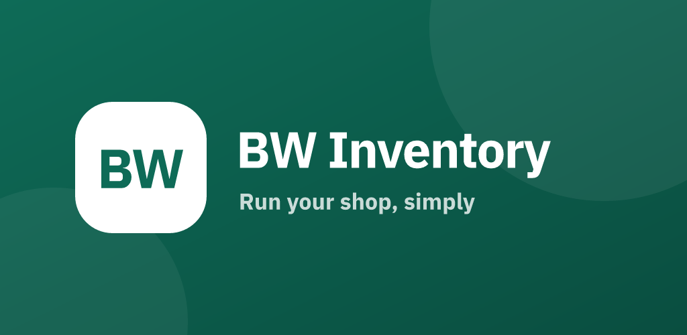

**Shop inventory, GST billing and khata — on desktop and phone.**

[bwinventory.husainbw.in](https://bwinventory.husainbw.in)

---

### Home
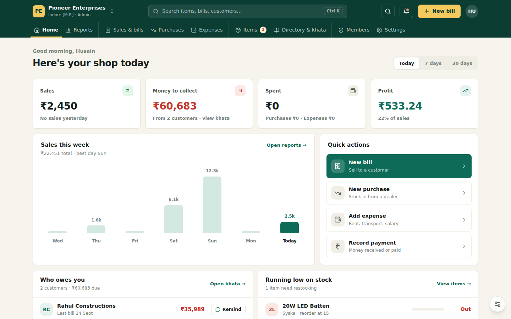

### New bill
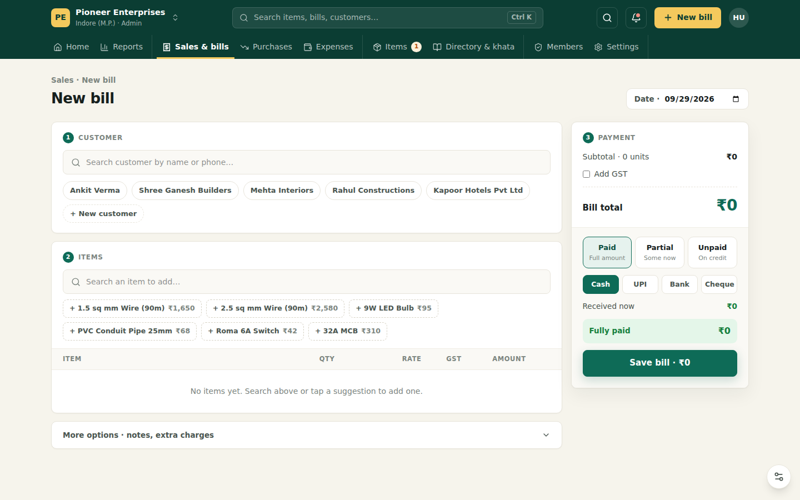

### Sales & bills
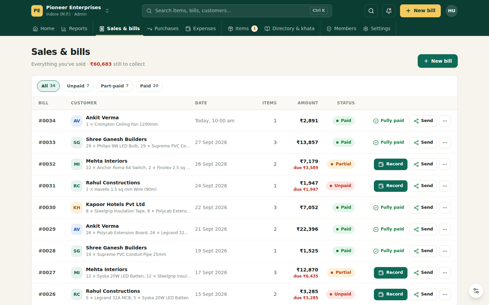

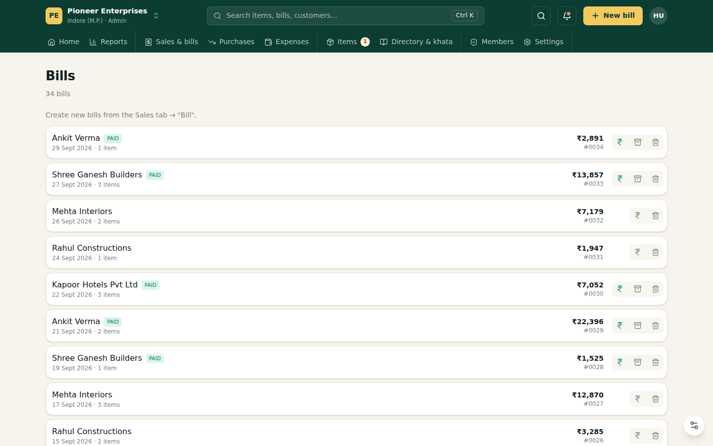

### Items & stock
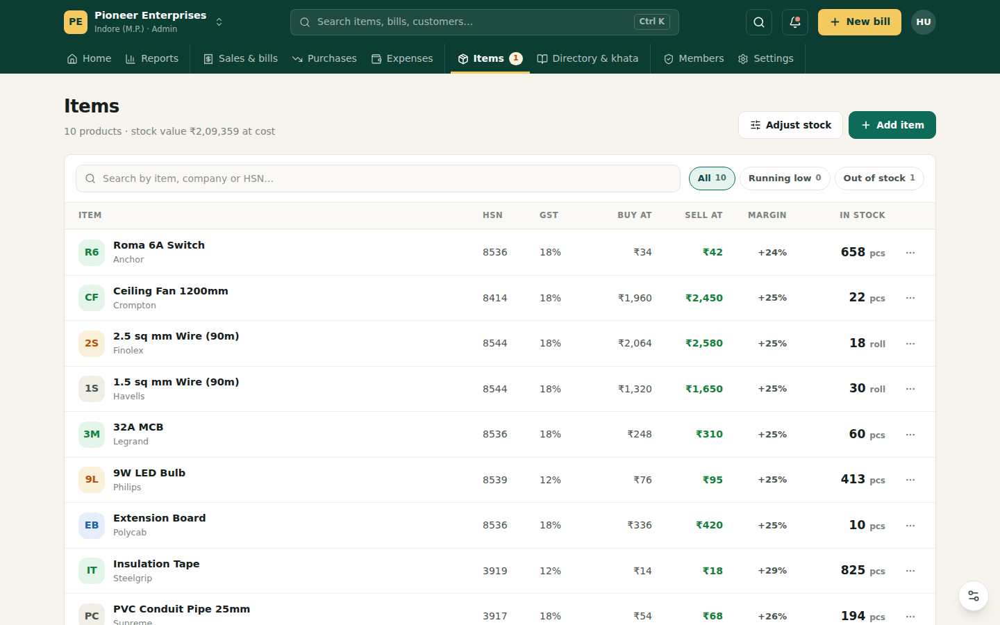

### Purchases
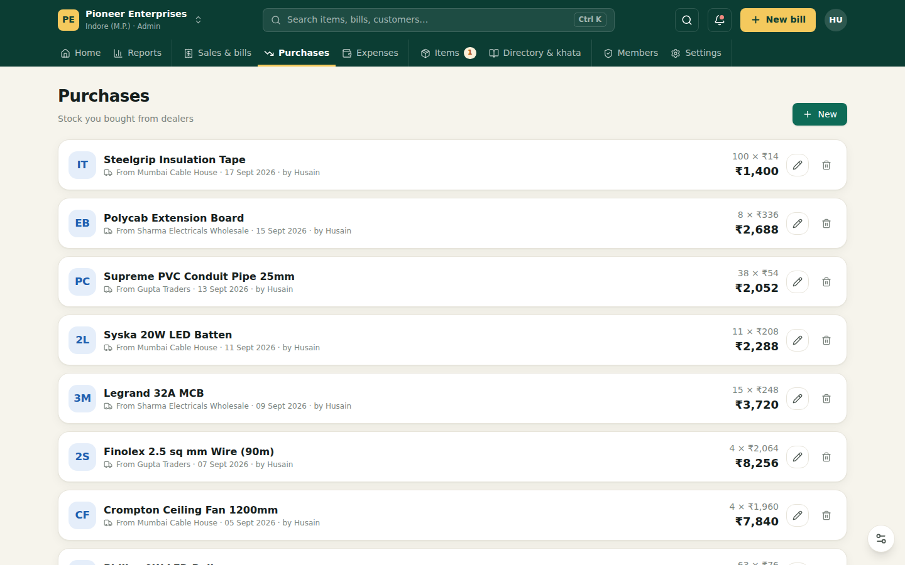

### Expenses
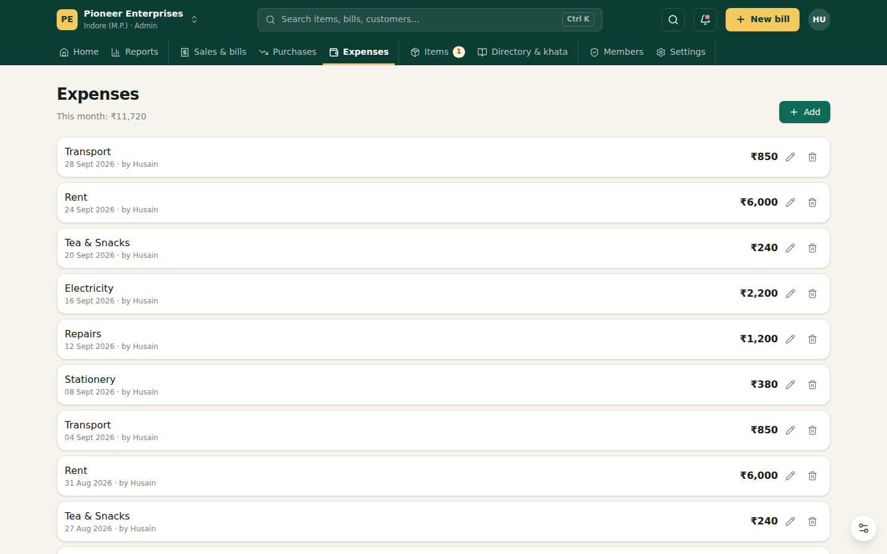

### Directory & khata
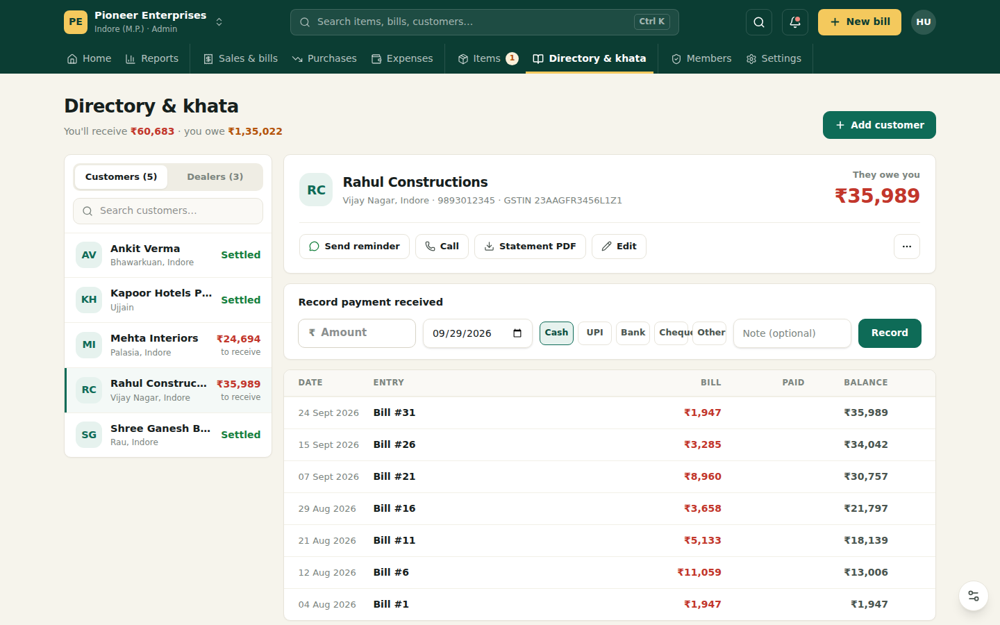

### Reports
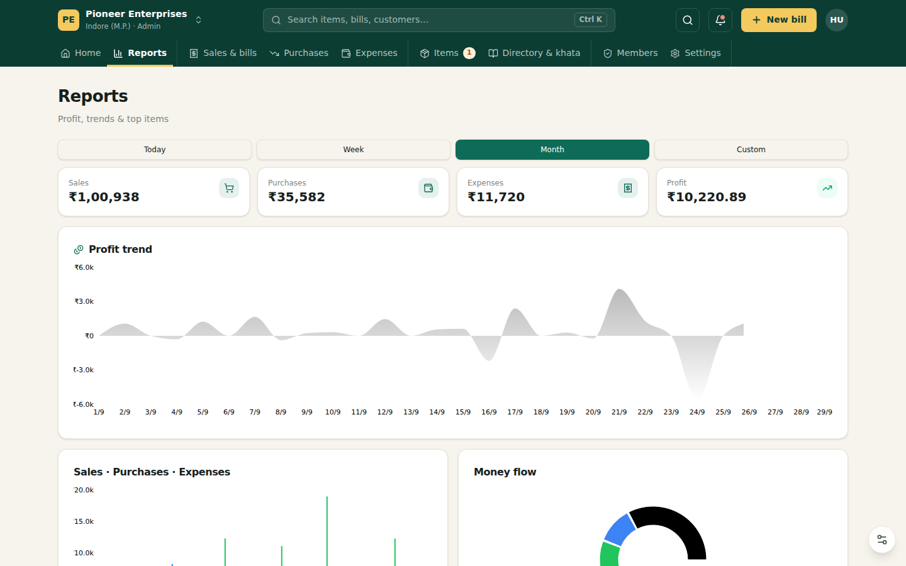

### Members
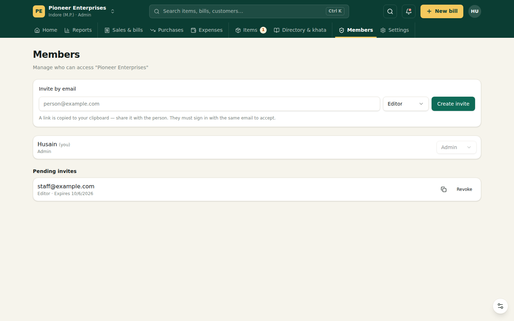

### Sign in
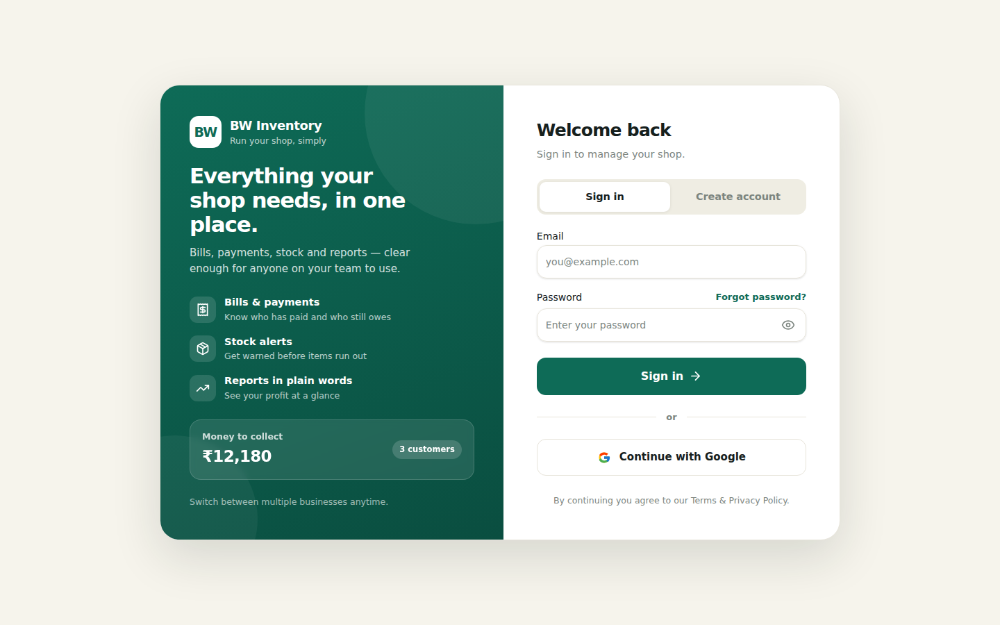

### On your phone

  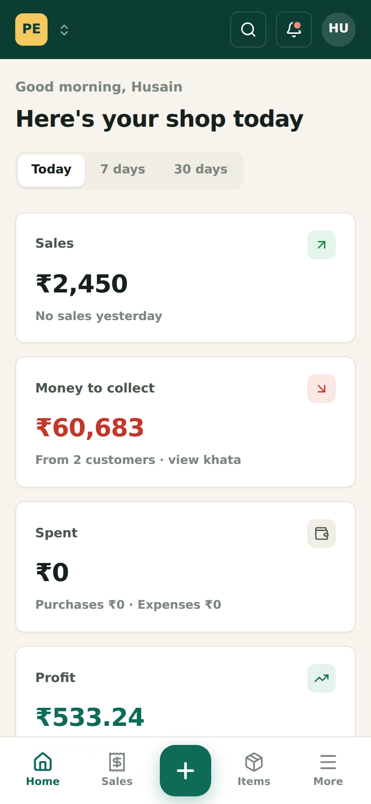
  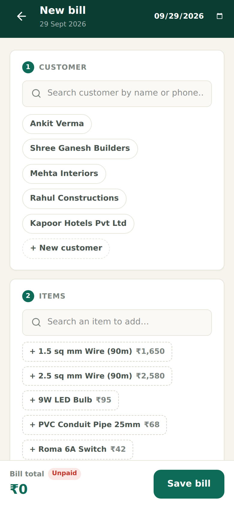
  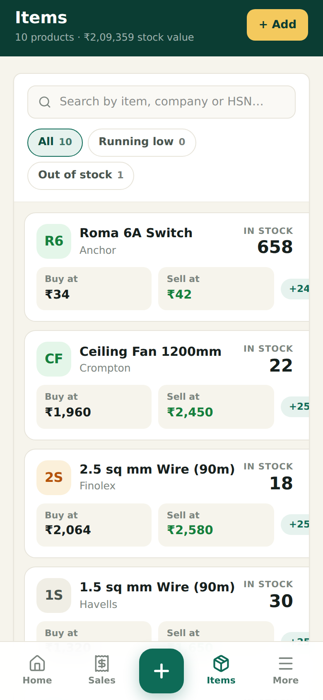
  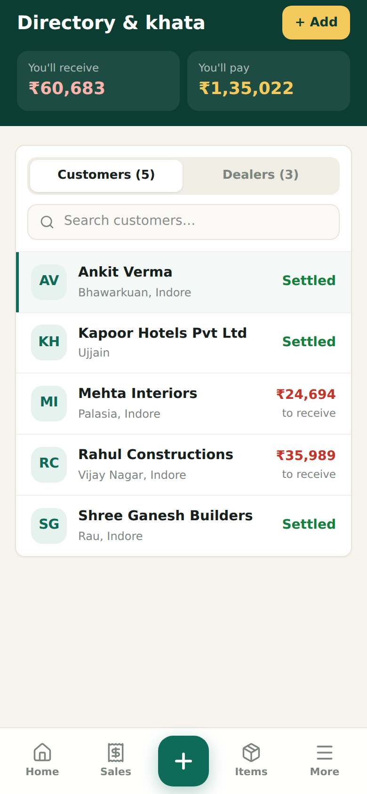
  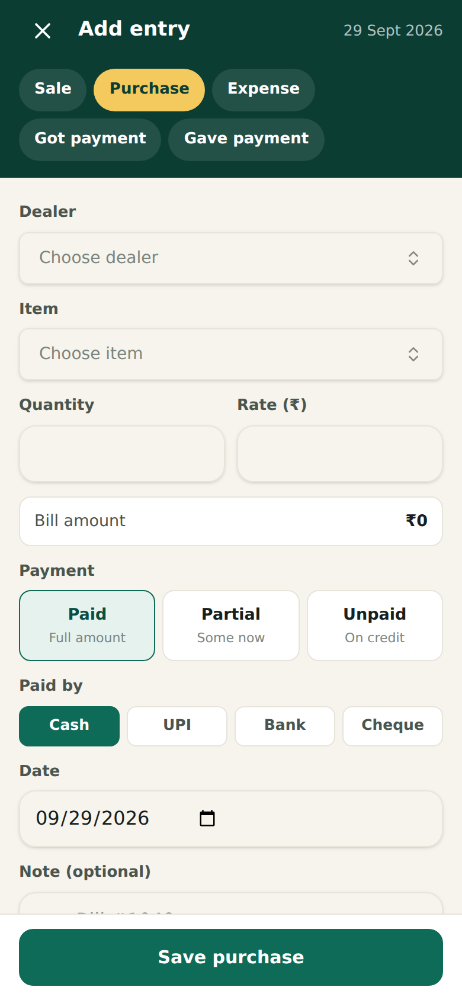

---

Screenshots use demo data. Setup, architecture and deployment: [docs/DEVELOPMENT.md](docs/DEVELOPMENT.md).
